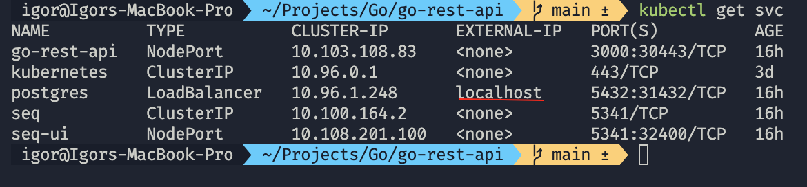
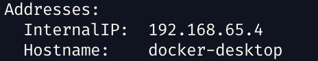
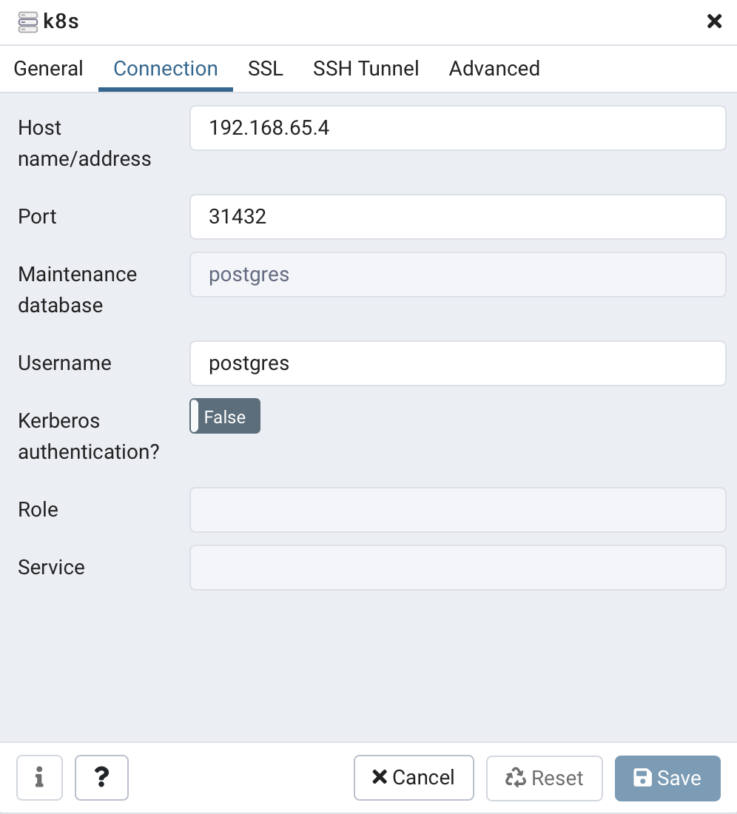

- Create a service of type `NodePort` or `LoadBalancer`.  
For **docker-desktop** it doesn't really matter. It exposes `LoadBalancer` services on `localhost`.  


    

- Find IP of your cluster. For example, it possible to run a command
    ``` shell
    kubectl describe node docker-desktop
    ```
    And there look for `Internal IP` section.  
    

- Use this address and specified `NodePort` to connect to service from outside the cluster.
    For example, connection to Postgres service run in k8s cluster from local machine looks as following:  
    
    
